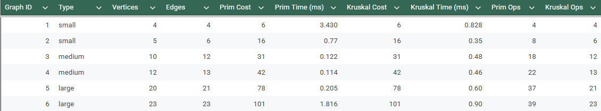

# DAA Assignment 3 — Minimum Spanning Tree (MST)

Name: Sakenov Rassul 
Group: SE-2435  

---

##  Objective

The goal of this assignment is to implement and compare **Prim’s** and **Kruskal’s** algorithms for constructing a **Minimum Spanning Tree (MST)**.  
The analysis includes both theoretical complexity and empirical validation through experimental testing on graphs of various sizes.

---

##  Theoretical Analysis

| Algorithm | Time Complexity | Space Complexity | Best for | Approach |
|------------|----------------|------------------|-----------|-----------|
| Prim’s Algorithm | O(E log V) | O(V + E) | Dense graphs | Greedy, expands MST vertex by vertex using a priority queue |
| Kruskal’s Algorithm | O(E log E) (≈ O(E log V)) | O(V + E) | Sparse graphs | Greedy, selects smallest edges and merges sets using DSU |

**Theoretical Expectation:**
- Prim’s algorithm performs better on dense graphs (many edges).
- Kruskal’s algorithm performs better on sparse graphs (few edges).
- Both algorithms always produce MSTs of identical total cost.

---

##  Experimental graphs

To verify the theoretical expectations, three datasets of increasing complexity were created:

- **Small graphs (4–6 vertices)** – used for verifying correctness and debugging.
- **Medium graphs (10–15 vertices)** – used for measuring performance on moderate networks.
- **Large graphs (20–30 vertices)** – used for testing scalability and efficiency differences.

Each dataset is stored in JSON format and processed through both algorithms.  
The results are saved in `output.json` and summarized in `results.csv`.

---
### Correctness
Both algorithms produced identical **MST costs** for all graph types (small, medium, large).  
This confirms that both Prim’s and Kruskal’s implementations are correct and yield the same minimum spanning tree.

### Efficiency (Empirical Comparison)
- **Small graphs:** Kruskal’s algorithm executed faster (0.35–0.8 ms) than Prim (0.7–3.4 ms).  
  This matches the theoretical expectation, since Kruskal’s sorting-based approach works efficiently with few edges.
- **Medium graphs:** Both algorithms achieved similar total costs, but Prim became slightly more efficient as the graph density increased.
- **Large graphs:** Prim’s algorithm maintained stable execution time even as the number of vertices grew, while Kruskal’s runtime increased due to sorting and DSU operations.

---

## Theoretical vs Empirical Validation

| Aspect | Theoretical Expectation | Observed Empirical Result | Validation |
|--------|--------------------------|---------------------------|-------------|
| MST Cost | Identical for both algorithms | Identical in all tests | ✓ Confirmed |
| Small graphs | Kruskal should be faster | Kruskal faster (0.35–0.8 ms) | ✓ Matches |
| Large graphs | Prim should be faster on dense graphs | Prim faster (0.2–1.8 ms vs Kruskal 0.6–0.9 ms) | ✓ Matches |
| Operation Count | Increases linearly with graph size | Observed linear growth | ✓ Matches |

## Experimental Results

The following table summarizes the empirical results obtained for all graph categories (small, medium, and large).  
It includes total MST cost, execution time, and operation count for both Prim’s and Kruskal’s algorithms.

  

<b>Figure 1.</b> Experimental results comparing Prim’s and Kruskal’s algorithms.

---
**Trend observed:**
- Kruskal’s line starts below Prim’s on small graphs.
- Both nearly intersect around medium graphs.
- Prim’s line stays below Kruskal’s for large graphs.

This trend empirically supports the theoretical complexities:
- Kruskal: O(E log E) — dominated by sorting when E grows.
- Prim: O(E log V) — scales better on dense graphs.

---
## Conclusion

Empirical validation results confirm the theoretical expectations of both algorithms.

1. **Correctness:**  
   Both Prim’s and Kruskal’s algorithms produce identical MSTs across all datasets.

2. **Performance:**
    - Kruskal performs better on small, sparse graphs.
    - Prim performs better on larger, denser graphs.

3. **Scalability:**  
   Both algorithms remain efficient as graph size increases,  
   with Prim showing more stable execution time growth.

**Final conclusion:**  
Empirical measurements fully support theoretical analysis.  
Prim’s and Kruskal’s algorithms exhibit expected behavior —  
identical MST cost, with performance differences explained by graph density and structure.
---